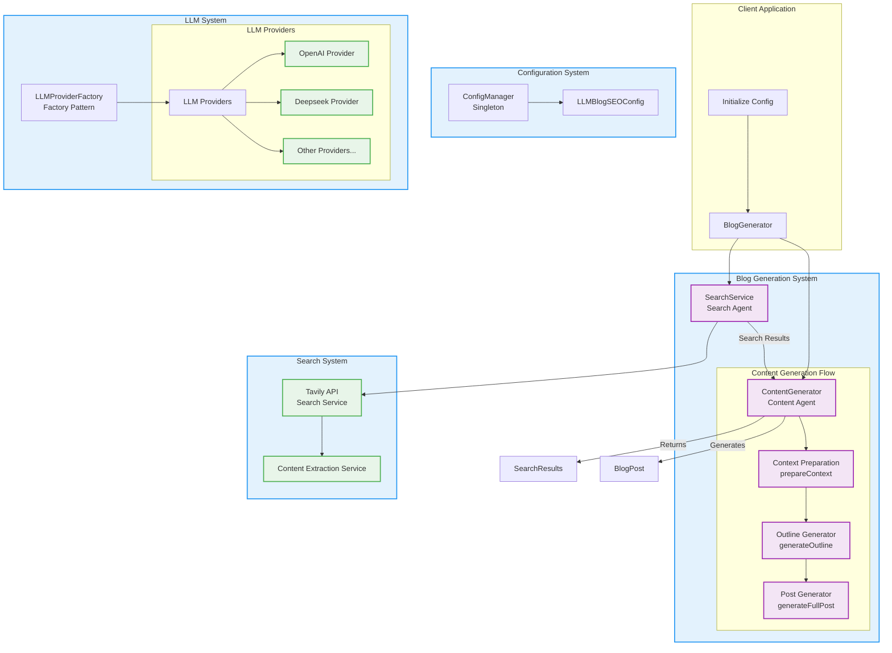

# llm-blog-seo

A powerful Node.js package that leverages LLMs (Large Language Models) and SEO best practices to automatically generate high-quality blog posts with proper research and citations.

[](https://badge.fury.io/js/llm-blog-seo)
[](https://opensource.org/licenses/MIT)

## Features

- 🤖 Support for multiple LLM providers (OpenAI, DeepSeek, with more coming soon)
- 🔍 Integrated research capabilities using Tavily API
- ✍️ Automatic blog post generation with customizable parameters
- 📊 SEO-optimized content with keyword targeting
- 🎯 Customizable writing styles and target audiences
- 📝 Automatic outline generation and content structuring
- 📚 Proper citations and references

## Installation

```bash
npm install llm-blog-seo
```

## Quick Start

```typescript
import { initialize, BlogGenerationConfig } from "llm-blog-seo";
// Initialize the package with your configuration
const generator = initialize({
  llm: {
    provider: "openai",
    apiKey: "your-openai-api-key",
  },
  tavily: {
    apiKey: "your-tavily-api-key",
  },
});
// Generate a blog post
const config: BlogGenerationConfig = {
  topic: "The Future of Artificial Intelligence",
  targetWordCount: 1500,
  style: "technical",
  targetAudience: "tech professionals",
  keywords: ["AI", "machine learning", "future technology"],
};
const blogPost = await generator.generateBlog(config);
console.log(blogPost);
```

## Configuration

### LLM Configuration

The package supports various LLM providers. Here's how to configure them:

```typescript
{
llm: {
provider: 'openai' | 'deepseek' | 'anthropic' | 'custom',
apiKey: string,
model?: string,
temperature?: number,
maxTokens?: number,
baseUrl?: string,
customHeaders?: Record<string, string>
}
}
```

### Tavily Search Configuration

```typescript
{
tavily: {
apiKey: string,
maxResults?: number,
searchDepth?: 'basic' | 'advanced'
}
}
```

### Default Settings

```typescript
{
defaults: {
style?: 'formal' | 'casual' | 'technical',
targetAudience?: string,
targetWordCount?: number
}
}
```

## Blog Generation Options

| Option          | Type                                | Description                       |
| --------------- | ----------------------------------- | --------------------------------- |
| topic           | string                              | The main topic of the blog post   |
| targetWordCount | number                              | Desired length of the blog post   |
| style           | 'formal' \| 'casual' \| 'technical' | Writing style                     |
| targetAudience  | string                              | Intended audience for the content |
| keywords        | string[]                            | Target keywords for SEO           |

## Response Format

The generated blog post will have the following structure:

```typescript
interface BlogPost {
  title: string;
  content: string;
  metadata: {
    wordCount: number;
    keywords: string[];
    references: string[];
  };
}
```

## Examples

See the [example.ts](src/example.ts) file for more detailed usage examples.

## Requirements

- Node.js 16.x or higher
- Valid API keys for your chosen LLM provider
- Tavily API key for research capabilities

## Contributing

Contributions are welcome! Please feel free to submit a Pull Request.

## License

This project is licensed under the MIT License - see the LICENSE file for details.

## Support

If you encounter any issues or have questions, please file an issue on the GitHub repository.

## Acknowledgments

- OpenAI for their GPT models
- Tavily for their research API
- All contributors who help improve this package

## Architecture


